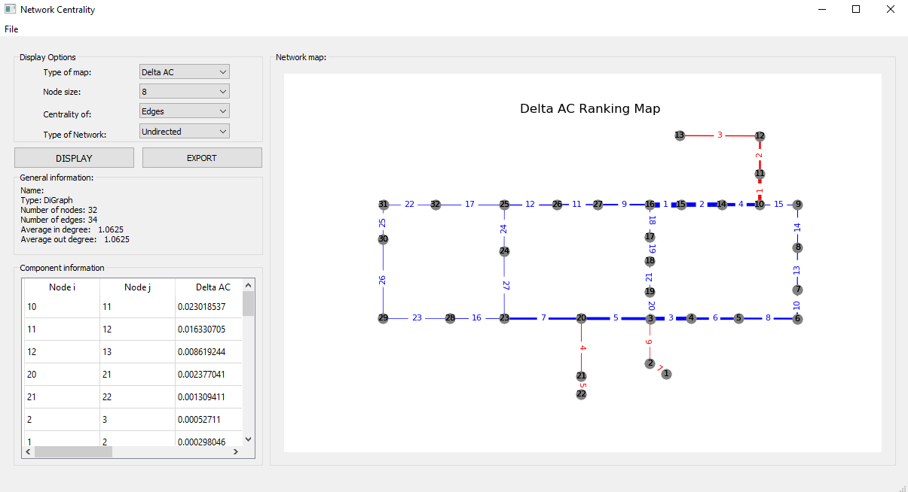
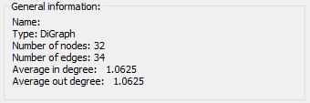
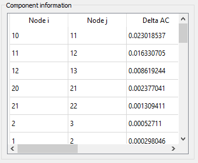
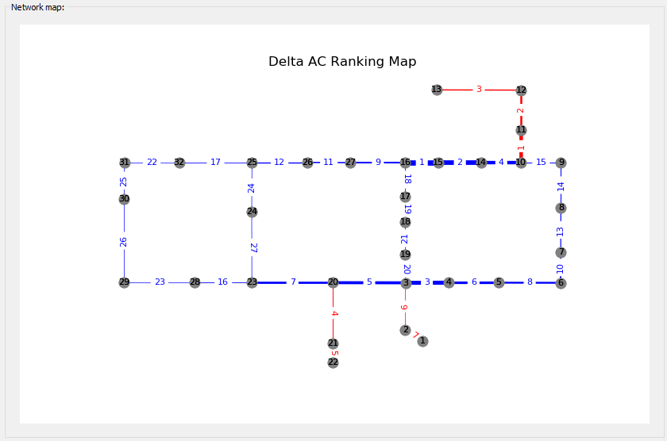
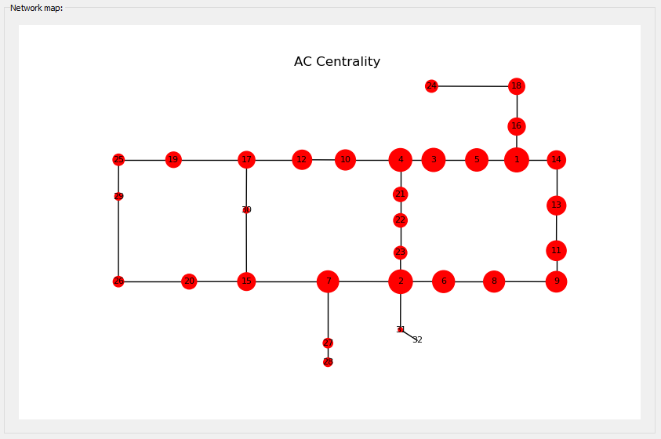

# Network Centrality Illustration Graphic User Interface (GUI) Version 1.0.0
This GUI developed to support for the observation on similarity between the betweeness centrality and the Algebraic Connectivity Centrality. The use of Algebraic Connectivity as an useful metric for Water Distribution Network has been develop by author and colleagues since 2017 with the following studies:

<a href="https://www.sciencedirect.com/science/article/abs/pii/S0951832018313899">Managing water main breaks in distribution networks––A risk-based decision making</a>

<a href="https://iwaponline.com/aqua/article-abstract/67/3/252/38122">Probability of network disconnection of water distribution system for maintenance prioritization</a>

<a href="https://www.researchgate.net/profile/Hieu_Phan9/publication/321490512_COMPLEX_NETWORK_ANALYSIS_FOR_WATER_DISTRIBUTION_SYSTEMS_BY_INCORPORATING_THE_RELIABILITY_OF_INDIVIDUAL_PIPES/links/5c198ed8299bf12be38a1933/COMPLEX-NETWORK-ANALYSIS-FOR-WATER-DISTRIBUTION-SYSTEMS-BY-INCORPORATING-THE-RELIABILITY-OF-INDIVIDUAL-PIPES.pdf">Complex Network Analysis for Water
Distribution Systems by Incoperating the Reliability of Individual Pipes</a>

## General interface:

  

## Options

### Input options
Input of the GUI including the .scv or .txt files including the .inp.txt files from EPANet. 

### Display options
Type of display map: 
+ Network layout
+ AC map
+ Betweeness map

Node size

Centrality of:
+Edges
+Nodes

Type of network:
+ Direct
+ Undirect

### General information
Example:

  

### Component information
Example:

  

### Network map
Example of edge Centrality map:

  

Example of node Centrality map:

  

